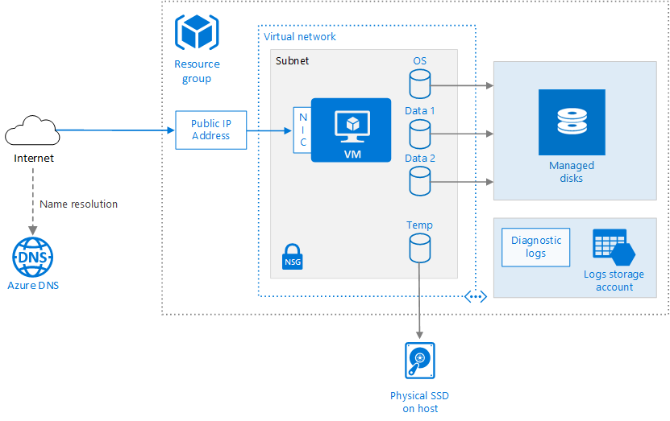

## <p align="center">Burke's Study Guide For AZ-204!
###  <p align="center">:collision: :weary: :question: :books: :computer: :headphones: :metal: :coffee: :muscle: :heavy_check_mark: :smirk:   


___

# <ins>[Azure Resource Manager](https://docs.microsoft.com/en-us/azure/azure-resource-manager/management/)
Azure Resource Manager is the deployment and management service for Azure. It provides a management layer that enables you to create, update, and delete resources in your Azure account. You use management features, like access control, locks, and tags, to secure and organize your resources after deployment.

When a user sends a request from any of the Azure tools, APIs, or SDKs, Resource Manager receives the request. It authenticates and authorizes the request. Resource Manager sends the request to the Azure service, which takes the requested action. Because all requests are handled through the same API, you see consistent results and capabilities in all the different tools.

The following image shows the role Azure Resource Manager plays in handling Azure requests.


## Terminology

* **resource** - A manageable item that is available through Azure. Virtual machines, storage accounts, web apps, databases, and virtual networks are examples of resources. Resource groups, subscriptions, management groups, and tags are also examples of resources.
* **resource group** - A container that holds related resources for an Azure solution. The resource group includes those resources that you want to manage as a group. You decide which resources belong in a resource group based on what makes the most sense for your organization. See Resource groups.
* **resource provider** - A service that supplies Azure resources. For example, a common resource provider is Microsoft.Compute, which supplies the virtual machine resource. Microsoft.Storage is another common resource provider. See Resource providers and types.
* **Resource Manager template** - A JavaScript Object Notation (JSON) file that defines one or more resources to deploy to a resource group, subscription, management group, or tenant. The template can be used to deploy the resources consistently and repeatedly. See Template deployment overview.
* **declarative syntax** - Syntax that lets you state "Here is what I intend to create" without having to write the sequence of programming commands to create it. The Resource Manager template is an example of declarative syntax. In the file, you define the properties for the infrastructure to deploy to Azure. See Template deployment overview.


---

# <ins>[ARM Templates](https://docs.microsoft.com/en-us/azure/azure-resource-manager/templates/)


### Basics
ARM templates are JSON files where you define what you want to deploy to Azure. Templates help you implement an infrastructure-as-code solution for Azure. Your organization can repeatedly and reliably deploy the required infrastructure to different environments.

In its simplest structure, a template has the following elements:
```
{
  "$schema": "https://schema.management.azure.com/schemas/2019-04-01/deploymentTemplate.json#",
  "contentVersion": "",
  "apiProfile": "",
  "parameters": {  },
  "variables": {  },
  "functions": [  ],
  "resources": [  ],
  "outputs": {  }
} 
```
### Schema
*Required*. Location of the JavaScript Object Notation (JSON) schema file that describes the version of the template language. The version number you use depends on the scope of the deployment and your JSON editor.

### Content Version
*Required*. Version of the template (such as 1.0.0.0). You can provide any value for this element. Use this value to document significant changes in your template. When deploying resources using the template, this value can be used to make sure that the right template is being used.

### API Profile
An API version that serves as a collection of API versions for resource types. Use this value to avoid having to specify API versions for each resource in the template. When you specify an API profile version and don't specify an API version for the resource type, Resource Manager uses the API version for that resource type that is defined in the profile.

The API profile property is especially helpful when deploying a template to different environments, such as Azure Stack and global Azure. Use the API profile version to make sure your template automatically uses versions that are supported in both environments.

### Resources
*Required*. In the resources section, you define the resources that are deployed or updated.

Example:
```
"resources": [
  {
    "type": "Microsoft.Storage/storageAccounts",
    "apiVersion": "2018-07-01",
    "name": "[concat('storage', uniqueString(resourceGroup().id))]",
    "comments": "Storage account used to store VM disks",
    "location": "[parameters('location')]",
    "metadata": {
      "comments": "These tags are needed for policy compliance."
    },
    "tags": {
      "Dept": "[parameters('deptName')]",
      "Environment": "[parameters('environment')]"
    },
    "sku": {
      "name": "Standard_LRS"
    },
    "kind": "Storage",
    "properties": {}
  }
]
```
### Parameters
In the parameters section of the template, you specify which values you can input when deploying the resources. You're limited to 256 parameters in a template. You can reduce the number of parameters by using objects that contain multiple properties. To pass parameter values, you can use either inline parameters or a parameter file.

* Always use parameters for user names and passwords (or secrets).

### Template Functions
Within your template, you can create your own functions. These functions are available for use in your template. Typically, you define complicated expressions that you don't want to repeat throughout your template. You create the user-defined functions from expressions and functions that are supported in templates.

### Variables
In the variables section, you construct values that can be used throughout your template. You don't need to define variables, but they often simplify your template by reducing complex expressions. The format of each variable matches one of the data types.

### Outputs
In the outputs section, you specify values that are returned from deployment. Typically, you return values from resources that were deployed.

### Validation

### Deployment
Deployment Options: Portal, CLI, Powershell, REST API, GITHub, Cloud Shell


**Azure CLI**

To deploy to a resource group use: 
```
az deployment group create --resource-group <resource-group-name> --template-file <path-to-template>
```
To deploy to a subscription:
```
az deployment sub create --location <location> --template-file <path-to-template>
```
To deploy to a management group:
```
az deployment mg create --location <location> --template-file <path-to-template>
```
To deploy to a tenant:
```
az deployment tenant create --location <location> --template-file <path-to-template>
```
##Additional Resources
https://www.youtube.com/watch?v=Ge_Sp-1lWZ4&t=21s
https://azure.microsoft.com/en-us/resources/templates/

---

# <ins>[Virtual Machines](https://docs.microsoft.com/en-us/azure/virtual-machines/)
Azure Virtual Machines (VM) is one of several types of on-demand, scalable computing resources that Azure offers. Typically, you choose a VM when you need more control over the computing environment than the other choices offer. Example below:



## Pwsh
Create Resource Group:
```
New-AzResourceGroup -Name powershellgrp -Location EastUS
```
Create VM:
```
New-AzVm -ResourceGroupName powershellgrp -Name aznewvm -Location EastUS -VirtualNetworkName "mynewVNet" -SubnetName "default" -SecurityGroupName "mynewNSG" -PublicIpAddressName "mypublicip" -OpenPorts 80,3389 
```


## CLI


Create a resource group with the az group create command. An Azure resource group is a logical container into which Azure resources are deployed and managed. The following example creates a resource group named myResourceGroup in the eastus location:
```
az group create --name myResourceGroup --location eastus
```
The following example creates a VM named myVM and adds a user account named azureuser. The --generate-ssh-keys parameter is used to automatically generate an SSH key, and put it in the default key location (~/.ssh). To use a specific set of keys instead, use the --ssh-key-values option.
```
az vm create \
  --resource-group myResourceGroup \
  --name myVM \
  --image UbuntuLTS \
  --admin-username azureuser \
  --generate-ssh-keys
```

## Operating Systems

Marketplace contains supported images. You can create custom images for other options.
**Windows** :
5 years of mainstream support + 5 years of extended support (10 years total)
* Server 2008 R2 SP1
* 2012 Datacenter
* 2012 Datacenter R2
* 2016 Datacenter
* 2019 Datacenter,
* 2012 Datacenter Server Core (no UI)
* 2012 Datacenter with Containers (pre-installed support for containers)
**Linux**:
Linux is not always free, depending on the distribution you choose.
* CentOS
* Ubuntu
* Red Hat Enterprise Linux (RHEL)
* Ubuntu Advantage
* SUSE Linux

## Sizes
Instance Family
* General Purpose - balanced VM
* Compute Optimized - double the CPU cores
* Memory Optimized - double the memory
* Storage Optimized - double the local storage
* GPU - access to a graphics processing unit
* High - performance Compute - fastest everything

**General Purpose - balanced VM**
“Balanced CPU-to-memory ratio. Ideal for testing and development, small to medium
databases, and low to medium traffic web servers.”
* D Series
* A Series (non-critical)
* B Series (economical)
* DC Series (preview, confidential computing)

**Compute Optimized - double the CPU cores**
“High CPU-to-memory ratio. Good for medium traffic web servers, network appliances, batch
processes, and application servers.”
* F Series

**Memory Optimized - double the memory**
“High memory-to-core ratio. Great for relational database servers, medium to large caches,
and in-memory analytics.”
* E Series
* D11-15
* G Series (includes powerful CPU for database workloads)
* M Series (certified for SAP HANA, up to 416 cores + 12 TB memory)

**Storage Optimized - double the local storage**
“High disk throughput and IO. Ideal for Big Data, SQL, and NoSQL databases.”
* L Series

**GPU - access to a graphics processing unit**
“Specialized virtual machines targeted for heavy graphic rendering and video editing
available with single or multiple GPUs.”
* N Series (incl NC, NV, ND)

**High-Performance Compute - fastest everything**
“Our fastest and most powerful CPU virtual machines with optional high-throughput network
interfaces (RDMA).”
* H Series (incl HB and HC)

## Payment Options
* Pay As You Go (PAYG) - charged by the minute
* Reserved VMs - a committment; pay for 1 or 3 years in advance, or paid monthly
* Spot Pricing - like an auction; bid on compute time only while available
* Hybrid Benefit - pay for Windows & SQL Server licenses through Enterprise
Agreement, likely cheaper

## [Custom Script Extension](https://docs.microsoft.com/en-us/azure/virtual-machines/extensions/custom-script-windows)
The Custom Script Extension downloads and executes scripts on Azure virtual machines. This extension is useful for post deployment configuration, software installation, or any other configuration or management tasks. Scripts can be downloaded from Azure storage or GitHub, or provided to the Azure portal at extension run time. The Custom Script Extension integrates with Azure Resource Manager templates, and can be run using the Azure CLI, PowerShell, Azure portal, or the Azure Virtual Machine REST API.
## Notes
* Permanent Storage charged separately
* Public IP addresses have a cost
* Bandwidth into Azure (egress) has a cost
* Region chosen affects pricing
* Can get Windows VM images with SQL Server, Biztalk, Sharepoint or Machine
Learning Server preinstalled, for additional licensing cost
* Can get Linux VM images with SQL Server and Machine Learning Server
preinstalled, for additional licensing cost
* the default VM size is Standard DS1

## Additional Resources

https://www.youtube.com/watch?v=iUaTq06m26g

# <ins>[Docker](https://docs.docker.com/)

Docker is an open platform for developing, shipping, and running applications. Docker enables you to separate your applications from your infrastructure so you can deliver software quickly. With Docker, you can manage your infrastructure in the same ways you manage your applications. By taking advantage of Docker’s methodologies for shipping, testing, and deploying code quickly, you can significantly reduce the delay between writing code and running it in production.

Example .net core application dockerized:

```
# syntax=docker/dockerfile:1
FROM mcr.microsoft.com/dotnet/sdk:6.0 AS build-env
WORKDIR /app

# Copy csproj and restore as distinct layers
COPY *.csproj ./
RUN dotnet restore

# Copy everything else and build
COPY ../engine/examples ./
RUN dotnet publish -c Release -o out

# Build runtime image
FROM mcr.microsoft.com/dotnet/aspnet:6.0
WORKDIR /app
COPY --from=build-env /app/out .
ENTRYPOINT ["dotnet", "aspnetapp.dll"]
```
# <ins>[Azure Container Registry](https://docs.microsoft.com/en-us/azure/container-registry/)

Azure Container Registry is a managed, private Docker registry service based on the open-source Docker Registry 2.0. Create and maintain Azure container registries to store and manage your private Docker container images and related artifacts.

Use Azure container registries with your existing container development and deployment pipelines, or use Azure Container Registry Tasks to build container images in Azure. Build on demand, or fully automate builds with triggers such as source code commits and base image updates.

## Additional Resources

https://www.youtube.com/watch?v=VcZH6AWhUGk

# <ins>[Azure Container Instances](https://docs.microsoft.com/en-us/azure/container-instances/)

Containers are becoming the preferred way to package, deploy, and manage cloud applications. Azure Container Instances offers the fastest and simplest way to run a container in Azure, without having to manage any virtual machines and without having to adopt a higher-level service.

Azure Container Instances is a great solution for any scenario that can operate in isolated containers, including simple applications, task automation, and build jobs. For scenarios where you need full container orchestration, including service discovery across multiple containers, automatic scaling, and coordinated application upgrades, we recommend Azure Kubernetes Service (AKS).

## CLI

Create a resource group:
```
az group create --name myResourceGroup --location eastus
```
Create a Container:
```
az container create --resource-group myResourceGroup --name mycontainer --image mcr.microsoft.com/azuredocs/aci-helloworld --dns-name-label aci-demo --ports 80
```
Check Status:
```
az container show --resource-group myResourceGroup --name mycontainer --query "{FQDN:ipAddress.fqdn,ProvisioningState:provisioningState}" --out table
```
Pull Container Logs:
```
az container logs --resource-group myResourceGroup --name mycontainer
```

## Aditional Resources

https://www.youtube.com/watch?v=jAWLQFi4USk
https://www.youtube.com/watch?v=7G_oDLON7Us

---

# <ins>[Azure App Serivce Web Apps](https://docs.microsoft.com/en-us/azure/app-service/)

Azure App Service enables you to build and host web apps, mobile back ends, and RESTful APIs in the programming language of your choice without managing infrastructure. It offers auto-scaling and high availability, supports both Windows and Linux, and enables automated deployments from GitHub, Azure DevOps, or any Git repo. This is platform as a service.

Spend time reading through the different plans and think about what features are available in each e.g. can auto scale on the standard plan but not the basic.
https://azure.microsoft.com/en-us/pricing/details/app-service/windows/

## CLI

## Pwsh


## DNS
You can configure Azure DNS to host a custom domain for your web apps. For example, you can create an Azure web app and have your users access it using either www.contoso.com or contoso.com as a fully qualified domain name (FQDN).

To do this, you have to create three records:
* A root "A" record pointing to contoso.com
* A root "TXT" record for verification
* A "CNAME" record for the www name that points to the A record

## Deployment Slots
Allow for multiple apps for staging and production etc. You can swap apps and set traffic percentage as needed.

## Notes
* Web jobs are background jobs. Be aware of supported languages like: Windows Binary (EXE), Powershell, Javascript etc.
* You cannot deploy new or updated App Service code by uploading to the Portal.
* The maximum number of apps you can install in a single App Service free account is 10

## Additional Resources

https://www.youtube.com/watch?v=4BwyqmRTrx8&t=46s


# <ins> [App Service Environment](https://docs.microsoft.com/en-us/azure/app-service/environment/)
The Azure App Service Environment is an Azure App Service feature that provides a fully isolated and dedicated environment for securely running App Service apps at high scale

# <ins> [Azure Functions](https://docs.microsoft.com/en-us/azure/azure-functions/)

Azure Functions is a serverless solution that allows you to write less code, maintain less infrastructure, and save on costs. Instead of worrying about deploying and maintaining servers, the cloud infrastructure provides all the up-to-date resources needed to keep your applications running.

## Triggers and Bindings

Triggers are what cause a function to run. A trigger defines how a function is invoked and a function must have exactly one trigger. Triggers have associated data, which is often provided as the payload of the function.

Binding to a function is a way of declaratively connecting another resource to the function; bindings may be connected as input bindings, output bindings, or both. Data from bindings is provided to the function as parameters.

You can mix and match different bindings to suit your needs. Bindings are optional and a function might have one or multiple input and/or output bindings.

Triggers and bindings let you avoid hardcoding access to other services. Your function receives data (for example, the content of a queue message) in function parameters. You send data (for example, to create a queue message) by using the return value of the function.

|Example scenario	|Trigger	|Input binding|	Output binding|
| --------------  | ------- | ----------- | ------------- |
|A new queue message arrives which runs a function to write to another queue.|	Queue*|	None|	Queue*|
|A scheduled job reads Blob Storage contents and creates a new Cosmos DB document.	|Timer|	Blob Storage|	Cosmos DB|
|The Event Grid is used to read an image from Blob Storage and a document from Cosmos DB to send an email.|	Event Grid|	Blob Storage and Cosmos DB|	SendGrid
A webhook that uses Microsoft Graph to update an Excel sheet.|	HTTP|	None|	Microsoft Graph|

Spend time going over supported bindings:
https://docs.microsoft.com/en-us/azure/azure-functions/functions-triggers-bindings?tabs=csharp

## CRON
| Expression     | Description    |  runs at   |
| -------------- | -------------- | ---------- |
| 0 * * * * *    |   every min    | 09:00:00; 09:01:00|
| 0 */5 * * * *  | every 5 min    | 09:00:00; 09:05:00|
| 0 0 * * * *    | every hour (hourly) | 09:00:00; 10:00:00; 11:00:00|
| 0 0 */6 * * *  | every 6 hours  | 06:00:00; 12:00:00; 18:00:00; 00:00:00 |
| 0 0 8-18 * * * | every hour between 8-18 | 08:00:00; 09:00:00; … 18:00:00; 08:00:00|
| 0 0 0 * * *    | every day (daily) | Mar 1, 2017 00:00:00; Mar 2, 2017 00:00:00 | 
| 0 0 10 * * *   | every day at 10:00:00 | Mar 1, 2017 10:00:00; Mar 2, 2017 10:00:00 |
| 0 0 * * * 1-5  | every hour on workdays | Mar 3 (FRI), 2017 22:00:00; Mar 3 (FRI), 2017 23:00:00; Mar 6 (MON), 2017 00:00:00|

## Notes 
* Function App name needs to be unique across azure
* If you want to restrict a function app from being accessed by the Internet, then don't use an HTTP trigger. If you need an HTTP trigger, you can restrict who calls it by IP address.

## Additional Resources

https://www.youtube.com/watch?v=Vxf-rOEO1q4
https://www.youtube.com/watch?v=zIfxkub7CLY

# <ins>[Azure Durable Functions](https://docs.microsoft.com/en-us/azure/azure-functions/durable/)
Durable Functions is an extension of Azure Functions that lets you write stateful functions in a serverless compute environment. The extension lets you define stateful workflows by writing orchestrator functions and stateful entities by writing entity functions using the Azure Functions programming model. Behind the scenes, the extension manages state, checkpoints, and restarts for you, allowing you to focus on your business logic.

## Function Chaining Pattern
## Fan Out/ Fan In Pattern
## Asynchronous API Pattern
## Monitor Pattern
## Human Interaction Pattern

# <ins>[Azure Batch](https://docs.microsoft.com/en-us/azure/batch/)
Azure Batch runs large-scale applications efficiently in the cloud. Schedule compute-intensive tasks and dynamically adjust resources for your solution without managing infrastructure.

## CLI

```
az batch account create \
    --name mybatchaccount \
    --storage-account mystorageaccount \
    --resource-group QuickstartBatch-rg \
    --location eastus2
```


# <ins> [Choosing an Azure Compute Service](https://docs.microsoft.com/en-us/azure/architecture/guide/technology-choices/compute-decision-tree)

Azure offers a number of ways to host your application code. The term compute refers to the hosting model for the computing resources that your application runs on. The following flowchart will help you to choose a compute service for your application.

If your application consists of multiple workloads, evaluate each workload separately. A complete solution may incorporate two or more compute services.


Definitions:

* **"Lift and shift"** is a strategy for migrating a workload to the cloud without redesigning the application or making code changes. Also called rehosting. For more information, see Azure migration and modernization center.
* **Cloud optimized** is a strategy for migrating to the cloud by refactoring an application to take advantage of cloud-native features and capabilities.
The output from this flowchart is a **starting point** for consideration. Next, perform a more detailed evaluation of the service to see if it meets your needs.

## Understand the hosting models
Cloud services, including Azure services, generally fall into three categories: IaaS, PaaS, or FaaS. (There is also SaaS, software-as-a-service, which is out of scope for this article.) It's useful to understand the differences.

**Infrastructure-as-a-Service** (IaaS) lets you provision individual VMs along with the associated networking and storage components. Then you deploy whatever software and applications you want onto those VMs. This model is the closest to a traditional on-premises environment, except that Microsoft manages the infrastructure. You still manage the individual VMs.

**Platform-as-a-Service** (PaaS) provides a managed hosting environment, where you can deploy your application without needing to manage VMs or networking resources. Azure App Service is a PaaS service.

**Functions-as-a-Service** (FaaS) goes even further in removing the need to worry about the hosting environment. In a FaaS model, you simply deploy your code and the service automatically runs it. Azure Functions is a FaaS service.

There is a spectrum from IaaS to pure PaaS. For example, Azure VMs can autoscale by using virtual machine scale sets. This automatic scaling capability isn't strictly PaaS, but it's the type of management feature found in PaaS services.

In general, there is a tradeoff between control and ease of management. IaaS gives the most control, flexibility, and portability, but you have to provision, configure and manage the VMs and network components you create. FaaS services automatically manage nearly all aspects of running an application. PaaS services fall somewhere in between.


# <ins> [Azure Storage Accounts](https://docs.microsoft.com/en-us/azure/storage/blobs/)
An Azure storage account contains all of your Azure Storage data objects: blobs, file shares, queues, tables, and disks. The storage account provides a unique namespace for your Azure Storage data that's accessible from anywhere in the world over HTTP or HTTPS. Data in your storage account is durable and highly available, secure, and massively scalable.

## Replication

## Notes
* Storage accounts are access by keys. Using SAS will let them have very granular access without exposing any other part of your storage account.
* The main reason for creating separate storage accounts is when you are having a lot of IO operations per second.

# <ins> [CosomosDB](https://docs.microsoft.com/en-us/azure/cosmos-db/)
Azure Cosmos DB is a fully managed NoSQL database for modern app development. Single-digit millisecond response times, and automatic and instant scalability, guarantee speed at any scale. Business continuity is assured with SLA-backed availability and enterprise-grade security. App development is faster and more productive thanks to turnkey multi region data distribution anywhere in the world, open source APIs and SDKs for popular languages. As a fully managed service, Azure Cosmos DB takes database administration off your hands with automatic management, updates and patching. It also handles capacity management with cost-effective serverless and automatic scaling options that respond to application needs to match capacity with demand.

## Partition Key
* Be a property that has a value which does not change. If a property is your partition key, you can't update that property's value.

* Have a high cardinality. In other words, the property should have a wide range of possible values.

* Spread request unit (RU) consumption and data storage evenly across all logical partitions. This ensures even RU consumption and storage distribution across your physical partitions.

Your container will require more than a few physical partitions when either of the following are true:

* Your container will have over 30,000 RU's provisioned

* Your container will store over 100 GB of data

## Indexing

## Data Consistency
Determine scenarios that warrant a particlulary consistency 

## Change Feed

## Notes

* Maximum storage per container	Unlimited

# <ins> [SQL Database](https://docs.microsoft.com/en-us/azure/azure-sql/)

## Geo-Replication

## Elastic Database Pool

## Notes
* ATP (Advanced Threat Protection) will detect attempts to hack your SQL Database.
* SQL Server uses port 1433 by default, unless you change it.
* Elastic pools share resources between all of the databases within it. But if all the databases have usage spikes at the same time, you're not getting the benefit of pooling them.
* The Always Encrypted feature, which requires a special client library, will ensure the data is encrypted at the client site and never decrypted inside Azure.

# <ins> [Table Storage](https://docs.microsoft.com/en-us/azure/storage/tables/)
Azure Table storage is a service that stores non-relational structured data (also known as structured NoSQL data) in the cloud, providing a key/attribute store with a schemaless design. Because Table storage is schemaless, it's easy to adapt your data as the needs of your application evolve. Access to Table storage data is fast and cost-effective for many types of applications, and is typically lower in cost than traditional SQL for similar volumes of data.

* Not as fully featured as sql database or cosmos db but cost effective
# <ins>[Blob Containers](https://docs.microsoft.com/en-us/azure/storage/blobs/)
Azure Blob storage is Microsoft's object storage solution for the cloud. Blob storage is optimized for storing massive amounts of unstructured data. Unstructured data is data that doesn't adhere to a particular data model or definition, such as text or binary data.

Blob storage is designed for:

* Serving images or documents directly to a browser.
* Storing files for distributed access.
* Streaming video and audio.
* Writing to log files.
* Storing data for backup and restore, disaster recovery, and archiving.
* Storing data for analysis by an on-premises or Azure-hosted service.

##Blobs
Azure Storage supports three types of blobs:

* **Block blobs** store text and binary data. Block blobs are made up of blocks of data that can be managed individually. Block blobs can store up to about 190.7 TiB.
* **Append blobs** are made up of blocks like block blobs, but are optimized for append operations. Append blobs are ideal for scenarios such as logging data from virtual machines.
* **Page blobs** store random access files up to 8 TiB in size. Page blobs store virtual hard drive (VHD) files and serve as disks for Azure virtual machines. For more information about page blobs, see Overview of Azure page blobs
# <ins>[Azure Authentication](https://docs.microsoft.com/en-us/azure/active-directory/fundamentals/)
Azure Active Directory (Azure AD) is Microsoft’s cloud-based identity and access management service, which helps your employees sign in and access resources in:

* External resources, such as Microsoft 365, the Azure portal, and thousands of other SaaS applications.

* Internal resources, such as apps on your corporate network and intranet, along with any cloud apps developed by your own organization
## Multi-Factor Authentication

## [Priviledged Identity Management](https://docs.microsoft.com/en-us/azure/active-directory/privileged-identity-management/)
Privileged Identity Management (PIM) is a service in Azure Active Directory (Azure AD) that enables you to manage, control, and monitor access to important resources in your organization. These resources include resources in Azure AD, Azure, and other Microsoft Online Services such as Microsoft 365 or Microsoft Intune.

# <ins> [Azure Access Control](https://docs.microsoft.com/en-us/azure/role-based-access-control/)

Azure role-based access control (Azure RBAC) is a system that provides fine-grained access management of Azure resources. Using Azure RBAC, you can segregate duties within your team and grant only the amount of access to users that they need to perform their jobs.

* The owner of a resource can grant access to it to others. The contributor can control the resource but not give access to it to others.

## CLI

## Pwsh
Use the New-AzRoleAssignment command to grant access:
```
New-AzRoleAssignment -ResourceGroupName rg1 -SignInName allen.young@live.com -RoleDefinitionName Reader -AllowDelegation
```
## Shared Access Signature
A shared access signature (SAS) is a URI that grants restricted access rights to Azure Storage resources. You can provide a shared access signature to clients who should not be trusted with your storage account key but to whom you wish to delegate access to certain storage account resources. By distributing a shared access signature URI to these clients, you can grant them access to a resource for a specified period of time, with a specified set of permissions.

The URI query parameters comprising the SAS token incorporate all of the information necessary to grant controlled access to a storage resource. A client who is in possession of the SAS can make a request against Azure Storage with just the SAS URI, and the information contained in the SAS token is used to authorize the request.

# <ins>Secure Data

## [Azure Key Vault](https://docs.microsoft.com/en-us/azure/app-service/app-service-key-vault-references)

# <ins>[Scaling Apps and Services](https://docs.microsoft.com/en-us/azure/app-service/manage-scale-up#:~:text=In%20your%20App%20Service%20app,options%20to%20show%20more%20tiers.)

There are two workflows for scaling, scale up and scale out, and this article explains the scale up workflow.

* **Scale up**: Get more CPU, memory, disk space, and extra features like dedicated virtual machines (VMs), custom domains and certificates, staging slots, autoscaling, and more. You scale up by changing the pricing tier of the App Service plan that your app belongs to.
* **Scale out**: Increase the number of VM instances that run your app. You can scale out to as many as 30 instances, depending on your pricing tier. App Service Environments in Isolated tier further increases your scale-out count to 100 instances. For more information about scaling out, see Scale instance count manually or automatically. There, you find out how to use autoscaling, which is to scale instance count automatically based on predefined rules and schedules.

The scale settings take only seconds to apply and affect all apps in your App Service plan. They don't require you to change your code or redeploy your application.

## Manual Scalling of Azure App Service
## Automatic Scalling of Azure App Service

# <ins> [Virtual Machine Scale Sets](https://docs.microsoft.com/en-us/azure/virtual-machine-scale-sets/)
Azure virtual machine scale sets let you create and manage a group of load balanced VMs. The number of VM instances can automatically increase or decrease in response to demand or a defined schedule. Scale sets provide high availability to your applications, and allow you to centrally manage, configure, and update a large number of VMs. With virtual machine scale sets, you can build large-scale services for areas such as compute, big data, and container workloads.

## Notes
* maximum number of virtual machines 1000


# <ins> [Redis Cache](https://docs.microsoft.com/en-us/azure/azure-cache-for-redis/)
Azure Cache for Redis provides an in-memory data store based on the Redis software. Redis improves the performance and scalability of an application that uses backend data stores heavily. It's able to process large volumes of application requests by keeping frequently accessed data in the server memory, which can be written to and read from quickly. Redis brings a critical low-latency and high-throughput data storage solution to modern applications.

Azure Cache for Redis offers both the Redis open-source (OSS Redis) and a commercial product from Redis Labs (Redis Enterprise) as a managed service. It provides secure and dedicated Redis server instances and full Redis API compatibility. The service is operated by Microsoft, hosted on Azure, and usable by any application within or outside of Azure.

Azure Cache for Redis can be used as a distributed data or content cache, a session store, a message broker, and more. It can be deployed as a standalone. Or, it can be deployed along with other Azure database services, such as Azure SQL or Cosmos DB.

Azure Cache for Redis offers Redis cluster as implemented in Redis. With Redis Cluster, you get the following benefits:

* The ability to automatically split your dataset among multiple nodes.
* The ability to continue operations when a subset of the nodes is experiencing failures or are unable to communicate with the rest of the cluster.
* More throughput: Throughput increases linearly as you increase the number of shards.
* More memory size: Increases linearly as you increase the number of shards.

# <ins> [CDN](https://docs.microsoft.com/en-us/azure/cdn/)
Azure Content Delivery Network (CDN) is a global CDN solution for delivering high-bandwidth content. It can be hosted in Azure or any other location. With Azure CDN, you can cache static objects loaded from Azure Blob storage, a web application, or any publicly accessible web server, by using the closest point of presence (POP) server. Azure CDN can also accelerate dynamic content, which cannot be cached, by leveraging various network and routing optimizations.

To programmatically cache application content in ASP.NET, follow these steps:

1. Verify that the content is marked as cacheable by setting HttpCacheability to Public.
2. Set a cache validator by calling one of the following HttpCachePolicy methods:
* Call SetLastModified to set a timestamp value for the Last-Modified header.
* Call SetETag to set a value for the ETag header.
3. Optionally, specify a cache expiration time by calling SetExpires to set a value for the Expires header. Otherwise, the default cache heuristics described previously in this document apply.
## Notes
* CDN can read the HTML as it passes through and automatically fetch the next files to be delivered without the client needing to ask.
# [Azure Monitor]()
Azure Monitor helps you maximize the availability and performance of your applications and services. It delivers a comprehensive solution for collecting, analyzing, and acting on telemetry from your cloud and on-premises environments. This information helps you understand how your applications are performing and proactively identify issues affecting them and the resources they depend on.

The following diagram gives a high-level view of Azure Monitor. At the center of the diagram are the data stores for metrics and logs, which are the two fundamental types of data used by Azure Monitor. On the left are the sources of monitoring data that populate these data stores. On the right are the different functions that Azure Monitor performs with this collected data. This includes such actions as analysis, alerting, and streaming to external systems.


# Notes
* Data Collector API is designed for you to create your own data inputs into Azure Monitor
# <ins> [Azure Cognitive Search](https://docs.microsoft.com/en-us/azure/search/)
Azure Cognitive Search (formerly known as "Azure Search") is a cloud search service that gives developers infrastructure, APIs, and tools for building a rich search experience over private, heterogeneous content in web, mobile, and enterprise applications.

# Notes
* Azure Search supports multiple data sources

# <ins> [Azure Service Health](https://docs.microsoft.com/en-us/azure/service-health/)
Azure Service Health is a suite of experiences that provide personalized guidance and support when issues in Azure services are or may affect you in the future. Azure Service Health is composed of Azure status, the service health service, and Resource Health.
# Notes
* Azure Service Health will monitor the health of the entire Azure platform and let you create alerts if something is happening that can affect you.

# <ins> [API Management](https://docs.microsoft.com/en-us/azure/api-management/)


## Notes
Policies allow you to modify the inbound request as well as the outbound results without modifying the API code itself.

The API Gateway outbound policy allows you to change the output headers before sending to the client

## Swagger/API

# [Event Grid](https://docs.microsoft.com/en-us/azure/event-grid/)
Azure Event Grid allows you to easily build applications with event-based architectures. First, select the Azure resource you would like to subscribe to, and then give the event handler or WebHook endpoint to send the event to. Event Grid has built-in support for events coming from Azure services, like storage blobs and resource groups. Event Grid also has support for your own events, using custom topics.

# [Event Hub](https://docs.microsoft.com/en-us/azure/event-hubs/)
Azure Event Hubs is a big data streaming platform and event ingestion service. It can receive and process millions of events per second. Data sent to an event hub can be transformed and stored by using any real-time analytics provider or batching/storage adapters.

The throughput capacity of Event Hubs is controlled by throughput units. Throughput units are pre-purchased units of capacity. A single throughput lets you:

* Ingress: Up to 1 MB per second or 1000 events per second (whichever comes first).
* Egress: Up to 2 MB per second or 4096 events per second.

# [Azure Storage Queues](https://docs.microsoft.com/en-us/azure/storage/queues/)
Azure Queue Storage is a service for storing large numbers of messages. You access messages from anywhere in the world via authenticated calls using HTTP or HTTPS. A queue message can be up to 64 KB in size. A queue may contain millions of messages, up to the total capacity limit of a storage account. Queues are commonly used to create a backlog of work to process asynchronously.
# [Service Bus Queue](https://docs.microsoft.com/en-us/azure/service-bus-messaging/)
Azure Service Bus is a fully managed enterprise message broker with message queues and publish-subscribe topics (in a namespace). Service Bus is used to decouple applications and services from each other, providing the following benefits:

* Load-balancing work across competing workers
* Safely routing and transferring data and control across service and application boundaries
* Coordinating transactional work that requires a high-degree of reliability

## Notes
* Service Bus Queue is enterprise-grade message queue.
# <ins>Glossary


**VHD** : Virtual Hard Disk

---
# <ins> Other Study Material
https://quizlet.com/de/513300250/microsoft-az-204-flash-cards/ (should be free and can use fully featured after login)

https://www.linkedin.com/learning/paths/prepare-for-the-developing-solutions-in-microsoft-azure-exam-az-204

https://www.udemy.com/course/70532-azure/?ranMID=39197&ranEAID=JVFxdTr9V80&ranSiteID=JVFxdTr9V80-djuiYD9XFBSye8cTxFzQxg&LSNPUBID=JVFxdTr9V80&utm_source=aff-campaign&utm_medium=udemyads
(can use free 7 day trial)